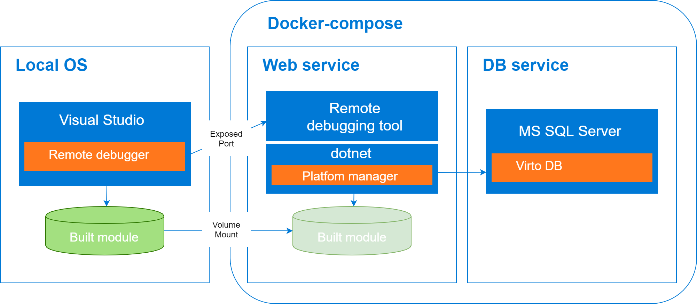
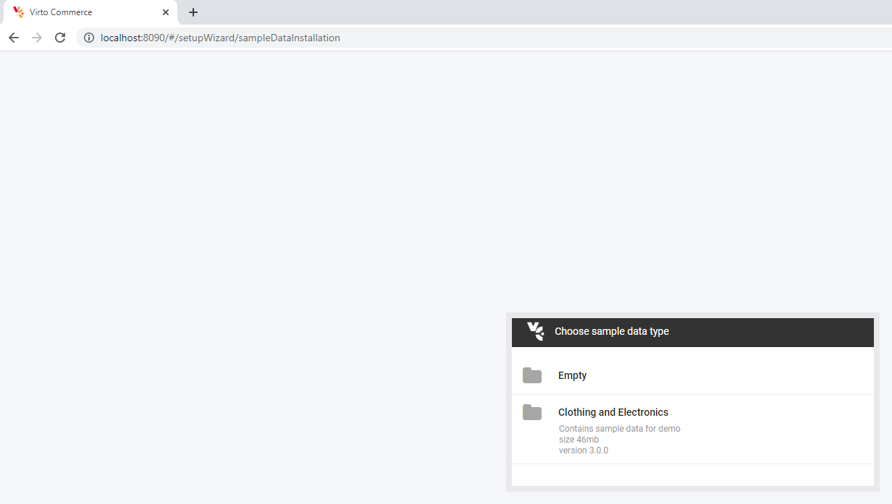
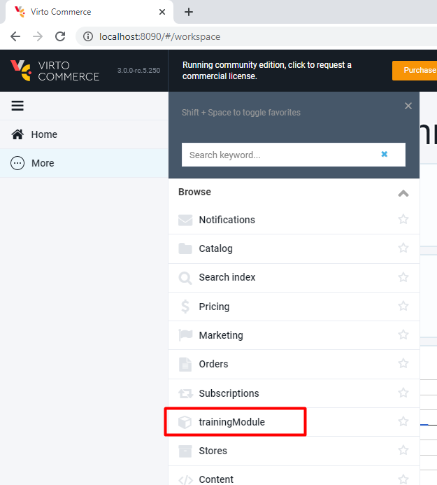

# Developing inside a Container

## Overview

The main idea is to simplify the initial setup process for Virto Commerce (VC) module development environment. This will speed up the onboarding process for new engineers who join our team.
Developers would only need to install Docker and Visual Studio, but not external tools / services (SQL Server, VC Platform). Coding is done in Visual Studio as usual, and the changes would be tracked and propagated from host to the container.

This sample contains code only for VC Platform Manager web app. _Storefront_ and _Theme_ are not included in this solution.

VC Platform Manager web app was containerized as 2 services: 1 for web service and 1 for database. It's run as a multi-container app and orchestrated by using _Docker Compose_.

Web service container is based on *virtocommerce/platform* latest Linux image. Additionally, Web service Docker file contains code for downloading and installing common VC modules.

In order to enable the debugging of a .Net Core app in a Linux container, Visual Studio downloads _vsdbg_ and maps it to the container. More information on *vsdbg.exe*: [Offroad debugging of .NET Core on Linux and OSX from Visual Studio](https://github.com/Microsoft/MIEngine/wiki/Offroad-Debugging-of-.NET-Core-on-Linux---OSX-from-Visual-Studio).

When the Web service container is started, the *VC Platform* instance and *vsdbg.exe* are activated on the container as well. *Vsdbg.exe* is interacting with Visual Studio and therefore developer is able to set the breakpoints and debug the code.

The Developer writes and builds code for a new module in Visual Studio locally, on host machine. In order to ensure that any code edits on host machine are automatically propagated to the container, folder with built module on host machine is automatically mapped to `/app` folder in the container. This is only possible through bind mounting. When a path in the host is mounted to a path in the container, the contents of the host directory will completely overwrite whatever is in the container directory, regardless of whether the container directory has files which were not present in the host directory at mount time. The result is that the container directory will be an exact snapshot of the host directory. This makes the development experience feel more natural. In order for the developed module to be available in *VC Platform* the contents of the `/app` folder should be placed to the `/opt/virtocommerce/platform/Modules/VirtoCommerce.TrainingModule` folder. This is done by the *ln* mount command in Linux.

## Prerequisites

* You need to have some basic understanding of [Docker](https://docs.docker.com/get-started/), [Docker Compose](https://docs.docker.com/compose/gettingstarted/), and the key terms used in the ecosystem.
* [Docker Desktop for Windows](https://docs.docker.com/docker-for-windows/install/) installed on your machine.

## How to install Docker for Windows

* For Docker installation, first review the information at Docker for Windows: [What to know before you install](https://docs.docker.com/docker-for-windows/install/#what-to-know-before-you-install)
* Install [Docker Desktop for Windows](https://docs.docker.com/docker-for-windows/install/) on your machine
* During installation you'll need to choose Linux as operating system used inside your containers

## How to use

1. Fork repository
1. Clone repository to local machine
1. Open solution in Visual Studio
1. Write code for new module
1. Build solution

The initial solution was generated using [Virto Commerce 3.x Module Template](https://marketplace.visualstudio.com/items?itemName=Virto-Commerce.VirtoCommerce3ModuleTemplates) for Visual Studio.

Then, the "_Container orchestrator support_" (_Docker Compose_ for _Linux_) was added directly from Visual Studio IDE. New Visual Studio project named "docker-compose" with the following files was generated:
  * docker-compose.yml
  * docker-compose.override.yml
  * docker-compose.vs.debug.yml
  * Dockerfile
  * .dockerignore

## How to build and run Docker containers

When the solution is opened in IDE, [Visual Studio tools for Docker](https://docs.microsoft.com/en-us/visualstudio/containers/overview?view=vs-2019) does automatically "_build_ and _up_" with _docker-compose_. First time start can take longer, as the base images (*mcr.microsoft.com/mssql/server:2019-GA-ubuntu-16.04*, *mcr.microsoft.com/dotnet/core/aspnet:3.1-buster-slim*, *virtocommerce/platform*) are downloaded and new image is built from Dockerfile.

_Visual Studio tools for Docker_ monitors docker-compose.yml, docker-compose.override.yml, docker-compose.vs.debug.yml, Dockerfile and rebuilds docker images automatically, when the files change.

Each time the solution is opened in Visual Studio, the containers for Web service and database are recreated.

You track see the progress for building images and starting up the containers in the "Output" window. Just choose "Container Tools" in "output from" menu:

**When the solution is closed, the created containers are deleted automatically. Thus, all changes made to the database or to VC Platform Manager configuration during debugging, will be lost.**

## How to write the code

Solution consists of 5 logically divided parts (projects):

* .Core – this is where keep the models and abstractions of Virto Commerce module services
* .Data – here you can find all the service implementations, repositories, entity models, migration data and configurations
* .Web – contains the module definition, WEB API, Scripts and Localization resources
* .Tests – for testing the service and repository layer methods with Unit test
* docker-compose - orchestration support for solution

Developer should write code for a new module in .Core, .Data and .Web projects as usual in Visual Studio locally on host machine.
Also developer should write tests for the new module in .Tests project.

## How to run Virto Commerce Platform Manager

Once the containers are started, open VC Platform Manager - http://localhost:8090 . This will launch the application with preinstalled default modules and give you opportunity to configure sample data.

After the sample data is imported, you can see the Platform Manager UI with a new module installed.

## How to debug module

* Build solution locally (press F6 in Visual Studio)
* Run Virto Commerce Platform Manager in your browser: http://localhost for w3wp.exe process will up in the container
* Within Visual Studio, select the **Attach to Process** action in the Debug window:

* Chose **Connection type** **Docker(Linux Container)** in opened window and press the **Find** button to find the remote connection:

The screenshot below shows the detected containers:

* Select **VirtoCommerce.TrainingModule.Web** container and press **Ok** button.

* Once the container has been selected, then the running process can be attached. For debugging a .Net Core application select `dotnet` process:

You can read more about Visual Studio remote debugging in the [Offroad debugging of .NET Core on Linux and OSX from Visual Studio](https://github.com/Microsoft/MIEngine/wiki/Offroad-Debugging-of-.NET-Core-on-Linux---OSX-from-Visual-Studio) article.

## How to

## Troubleshooting

* How to diagnose [Docker problems](https://docs.docker.com/docker-for-windows/troubleshoot)
* How to troubleshoot [Visual Studio Docker development](https://docs.microsoft.com/ru-ru/visualstudio/containers/troubleshooting-docker-errors?view=vs-2019)

## License

Copyright (c) Virto Solutions LTD.  All rights reserved.

Licensed under the Virto Commerce Open Software License (the "License"); you
may not use this file except in compliance with the License. You may
obtain a copy of the License at

<http://virtocommerce.com/opensourcelicense>

Unless required by applicable law or agreed to in writing, software
distributed under the License is distributed on an "AS IS" BASIS,
WITHOUT WARRANTIES OR CONDITIONS OF ANY KIND, either express or
implied.
