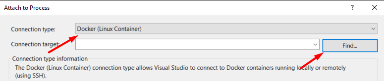
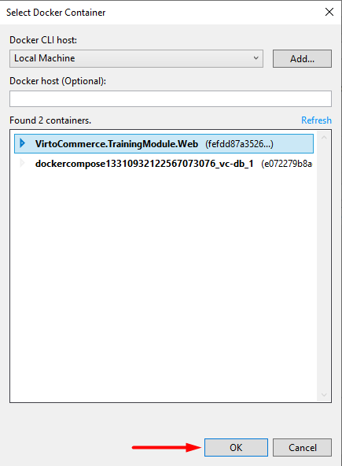

# Developing inside a Container

## Overview

The main idea is to simplify the initial setup process for development environment. This will speed up the onboarding process for new engineers who join to our team.
Developers would only need to download Docker and Visual Studio, and not have to install external tools and services (IIS, SQL Server, Virto Commerce Platform Manager). Code edits will be done from the Visual Studio as per normal and the changes will be tracked and propagated from host to the container.

This sample contains code only for Virtocommerce Platform Manager web app. Storefront and Theme are not included in this solution.

Virto Commerce Platform Manager web app containerized as 2 services: 1 for web service and 1 for database. It runs as a multi-container app and orchestrate it using Docker Compose.


Web service container based on *virtocommerce/platform* latest image. Additionally Web service Docker file contains code for download and install Virto Commerce modules and [Visual Studio Remote Tool](https://visualstudio.microsoft.com/downloads#remote-tools-for-visual-studio-2019) to enabling the debug of a .Net Framework app.

When the Web service container is started, then the *Virto Commerce Platform Manager* and *msvsmon.exe* is executed on the container as well, because *msvsmon.exe* and *IIS* is defined as an entrypoint. *Msvsmon.exe* is interacting with Visual Studio and therefore developer is able to set a breakpoint and debug the code.

Developer write and build code for a new module in Visual Studio locally on host machine. To ensure that any code edits on host machine are automatically propagated to the container, folder with built module on host machine is mapped to c:\vc-platform\modules folder in the container. This is only possible through bind mounting, which works similar to a *mklink* mount in Windows. When a path in the host mounted to a path in the container, the contents of the host directory will completely overwrite whatever is in the container directory, regardless of whether the container directory has files which were not present in the host directory at mount time. The result is that the container directory will be an exact snapshot of the host directory. This makes the development experience feel more natural.

## Prerequisites

* You need to have some basic understanding of [Docker](https://docs.docker.com/get-started/), [Docker Compose](https://docs.docker.com/compose/gettingstarted/), and the key terms used in the ecosystem.
* Installed [Docker desktop for Windows](https://docs.docker.com/docker-for-windows/install/) on your machine.

## How to install Docker for Windows

* For Docker installation, first review the information at Docker for Windows: [What to know before you install](https://docs.docker.com/docker-for-windows/install/#what-to-know-before-you-install)
* Install [Docker desktop for Windows](https://docs.docker.com/docker-for-windows/install/) on your machine
* During installation you'll need to chose Windows as operating system used inside your containers

## How to use

1. Fork repository
1. Clone repository to local machine
1. Open solution in Visual Studio
1. Write code for new module
1. Build solution

Current solution based on [template](https://marketplace.visualstudio.com/items?itemName=Virto-Commerce.VirtoCommerceModuleTemplates) for a new Virto Commerce module creation. To template solution added support for Docker Compose to a Visual Studio 2019 project, it adds the following elements in the solution:

* New Visual Studio Project named “docker-compose” with the following files:
  * docker-compose.yml
  * docker-compose.override.yml
  * docker-compose.vs.debug.yml
  * Dockerfile
  * .dockerignore

## How to build and run Docker containers

When you open solution [Visual Studio tools for Docker](https://docs.microsoft.com/en-us/visualstudio/containers/overview?view=vs-2019) automatically build and up docker-compose. First start can take long time for downloading base images (*microsoft/mssql-server-windows-express*, *mcr.microsoft.com/dotnet/framework/aspnet*, *virtocommerce/platform*) and building image from Docker file.

[Visual Studio tools for Docker](https://docs.microsoft.com/en-us/visualstudio/containers/overview?view=vs-2019) monitor changes in docker-compose.yml, docker-compose.override.yml, docker-compose.vs.debug.yml, Dockerfile and rebuild docker images automatically if files was changed.

Each time you open the solution, Visual Studio automatically creates containers for Web service and database service.

You can look for building images and starting up the containers in the output window by choosing Container tools in the drop-down menu.


When the solution closes, the created containers are automatically deleted. This means that all changes were made to the database or to the Virto Commerce Platform Manager configuration during application debugging will be lost after the solution is closed.

## How to write the code

Solution consists of 5 logically divided parts (projects):

* .Core – this is where keep the models and abstractions of Virto Commerce module services
* .Data – here you can find all the service implementations, repositories, entity models, migration data and configurations
* .Web – contains the module definition, WEB API, Scripts and Localization resources
* .Test – for testing the service and repository layer methods with Unit test
* docker-compose - orchestration support for solution

Developer should write code for a new module in .Core, .Data and .Web projects as usual in Visual Studio locally on host machine.
Also developer should write tests for the new module in .Test project.

## How to run Virto Commerce Platform Manager

Docker would bind Virto Commerce Platform Manager web app to port 80 by default. So, if you also have IIS server running locally, consider stopping it or changing the port in order to resolve port conflict.

To configure the default IIS website port number:

* Open IIS manager.
* Select **Default Web Site** from the left tree in IIS manager.
* Click **Bindings** from the right sidebar to open a dialog box.
* Select **http** record from the grid and hit Edit.
* Enter your choice of port number different from 80 in **Port** Text box and hit OK.

Once the containers are started, open Virto Commerce Platform Manager - http://localhost . This will launch the application with preinstalled default modules and give you opportunity to configure sample data.


After the sample data is imported, you can see the Platform Manager UI with a new module installed.


## How to debug module

* Build solution locally (press F6 in Visual Studio)
* Run Virto Commerce Platform Manager in your browser: http:\\localhost for w3wp.exe process will up in the container
* Within Visual Studio, select the **Attach to Process** action in the Debug window:


* Chose **Connection type** **Remote** in opened window and press the **Find** button to find the remote connection:



The screenshot below shows the detected containers:



* Select container and press **Select** button.

* Once the container has been selected, then the running process can be attached.
For debugging a IIS web application select w3wp.exe process:


You can read more about Visual Studio remote debugging in this [article](https://docs.microsoft.com/en-us/visualstudio/debugger/attach-to-running-processes-with-the-visual-studio-debugger?view=vs-2019).

## How to

### How to enable migrations

When you try to enable migrations by running the command:

```cmd
enable-migrations –MigrationsDirectory Migrations
```

in the solution with docker-compose project you get an error:

```cmd
Exception calling “SetData” with “2” argument(s): “Type ‘Microsoft.VisualStudio.ProjectSystem.VS.Implementation.Package.Automation.OAProject’ in assembly ‘Microsoft.VisualStudio.ProjectSystem.VS.Implementation, Version=16.0.0.0, Culture=neutral, PublicKeyToken=b03f5f7f11d50a3a’ is
not marked as serializable.”
```

This is a feature of a solution with docker-compose suport. In order to avoid the error you should run any EF Command with -StartupProject “YourInitialAppProject” parameter.

For example to enable migrations use following command

```cmd
enable-migrations -StartupProject "CustomerReviewsModule.Web"
```

## Troubleshooting

* How to diagnose [Docker problems](https://docs.docker.com/docker-for-windows/troubleshoot)
* How to troubleshoot [Visual Studio Docker development](https://docs.microsoft.com/ru-ru/visualstudio/containers/troubleshooting-docker-errors?view=vs-2019)

## License

Copyright (c) Virto Solutions LTD.  All rights reserved.

Licensed under the Virto Commerce Open Software License (the "License"); you
may not use this file except in compliance with the License. You may
obtain a copy of the License at

<http://virtocommerce.com/opensourcelicense>

Unless required by applicable law or agreed to in writing, software
distributed under the License is distributed on an "AS IS" BASIS,
WITHOUT WARRANTIES OR CONDITIONS OF ANY KIND, either express or
implied.
